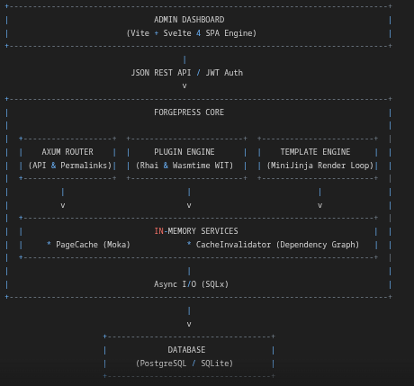
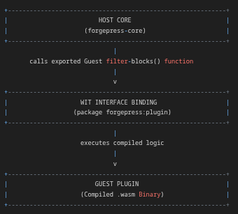
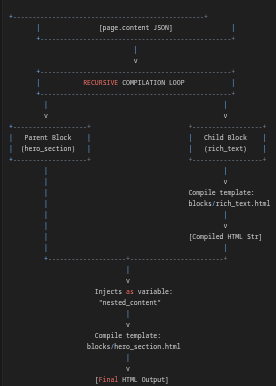
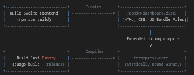

# This is in Development, Early Alpha Stage.
# ForgePress: Architecture, Design, and Implementation Specification

ForgePress is a modular content management system (CMS) written in Rust. It decouples content storage and administration from content delivery, bringing systems-level performance, memory safety, and sandboxed extensibility to web publishing.

Instead of traditional, regex-heavy rendering loops and rigid database structures, ForgePress uses a decoupled JSONB Block Architecture, a sandboxed WebAssembly (Wasm) and Rhai plugin engine, and an in-memory concurrently invalidated template cache.

## 1. Core Architectural Paradigms



A. The JSONB Page Builder Layout Strategy

Traditional CMS platforms rely on complex relational joins (EAV schemas/postmeta tables) to handle layout builders. This leads to the "N+1 query problem" and slow response times under load. ForgePress keeps metadata relational (slugs, authors, status) but stores visual layouts and custom fields in a single PostgreSQL binary JSON (JSONB) or SQLite JSON-validated TEXT column called `content`.

- Atomic Updates: Saving a page requires only a single UPDATE query on one cell.
- No Database Migrations: When a developer builds a custom page-builder widget, they do not need to alter database tables. They simply save their data format into the JSON array.
- High Performance: Standard page loading requires only a single SELECT query matching the page slug.

B. Sandboxed Extensibility (Rhai & WebAssembly)

To prevent third-party plugin code from crashing the web server, leaking memory, or accessing unauthorized files, ForgePress isolates dynamic code:

- Lightweight Scripting (Rhai): Safe, fast, sandboxed scripts that run inline using Rust-native bindings to intercept hooks and filters (e.g., `before_post_save`).
- Binary Extensions (Wasm): Complex plugins compile to WebAssembly components and run inside a sandboxed wasmtime runtime, utilizing a strict Guest/Host interface contract defined with WASI Preview 2 and WIT.

C. Zero-JS Theme Rendering

Themes are written using standard HTML with Jinja-style placeholders (MiniJinja). The Rust template engine recursively processes the JSONB block tree, compiles the HTML fragments, and streams the finished page to the user at static-file speeds.

## 2. Workspace Crate Architecture

ForgePress is structured as a multi-crate cargo workspace to enforce logical separation and clean boundaries between the runtime server, SDKs, CLIs, and the admin panel:

- `forgepress-core` (The Runtime Engine): The heart of the platform. Built on the asynchronous axum v0.7 framework and powered by tokio, it manages database pools, template rendering, and plugin execution.
- `forgepress-plugin-sdk` (Developer Extension Library): A type-safe library wrapper that exposes our WebAssembly Interface Type (WIT) contract to third-party developers. It translates low-level Wasm binary types into rich Rust structures containing native `serde_json::Value` elements.
- `forgepress-cli` (Administrative CLI Tool): A command-line utility used to run server maintenance, register administrators directly into the database using Argon2id, scaffold default visual theme templates, and securely purge server memory cache via signature-authenticated webhooks.
- `admin-dashboard` (Visual Page Builder Front-End): A lightweight single-page application built on Vite and Svelte 4. It compiles down to highly compressed static HTML, JS, and CSS files with zero runtime framework overhead. During production builds, these static assets are compiled directly inside the Rust core binary.

## 3. Database Schema Specification

### A. PostgreSQL Schemas

**Users Table**

Handles standard relational user storage with UUIDs and security properties.

```sql
CREATE EXTENSION IF NOT EXISTS "uuid-ossp";

CREATE TABLE users (
    id UUID PRIMARY KEY DEFAULT gen_random_uuid(),
    username VARCHAR(100) UNIQUE NOT NULL,
    email VARCHAR(255) UNIQUE NOT NULL,
    password_hash VARCHAR(255) NOT NULL,
    role VARCHAR(50) NOT NULL DEFAULT 'Subscriber',
    created_at TIMESTAMPTZ NOT NULL DEFAULT CURRENT_TIMESTAMP,
    updated_at TIMESTAMPTZ NOT NULL DEFAULT CURRENT_TIMESTAMP
);

CREATE INDEX idx_users_username ON users(username);
CREATE INDEX idx_users_email ON users(email);
```

**Pages Table**

Implements core CMS page storage, placing page structures into a native JSONB column.

```sql
CREATE TABLE pages (
    id UUID PRIMARY KEY DEFAULT gen_random_uuid(),
    title VARCHAR(255) NOT NULL,
    slug VARCHAR(255) UNIQUE NOT NULL,
    status VARCHAR(50) NOT NULL DEFAULT 'draft',
    author_id UUID REFERENCES users(id) ON DELETE SET NULL,
    content JSONB NOT NULL DEFAULT '[]'::jsonb, -- Stores the visual block layout tree
    meta JSONB NOT NULL DEFAULT '{}'::jsonb,    -- Stores unstructured SEO/metadata properties
    published_at TIMESTAMPTZ,
    created_at TIMESTAMPTZ NOT NULL DEFAULT CURRENT_TIMESTAMP,
    updated_at TIMESTAMPTZ NOT NULL DEFAULT CURRENT_TIMESTAMP
);

CREATE INDEX idx_pages_slug ON pages(slug);
CREATE INDEX idx_pages_status ON pages(status);
CREATE INDEX idx_pages_meta ON pages USING gin (meta);
```

**Taxonomies Table**

Establishes categories, tags, and standard WordPress-like many-to-many relationship structures.

```sql
CREATE TABLE taxonomies (
    id UUID PRIMARY KEY DEFAULT gen_random_uuid(),
    name VARCHAR(255) NOT NULL,
    slug VARCHAR(255) NOT NULL,
    taxonomy_type VARCHAR(100) NOT NULL, -- 'category', 'tag', or custom
    UNIQUE (slug, taxonomy_type)
);

CREATE TABLE pages_taxonomies (
    page_id UUID REFERENCES pages(id) ON DELETE CASCADE,
    taxonomy_id UUID REFERENCES taxonomies(id) ON DELETE CASCADE,
    PRIMARY KEY (page_id, taxonomy_id)
);

CREATE INDEX idx_pages_taxonomies_page ON pages_taxonomies(page_id);
CREATE INDEX idx_pages_taxonomies_tax ON pages_taxonomies(taxonomy_id);
```

**Options Table**

Central key-value configuration storage (the equivalent of `wp_options`).

```sql
CREATE TABLE options (
    option_key VARCHAR(255) PRIMARY KEY,
    option_value TEXT NOT NULL -- Stored as serialized JSON strings
);
```

### B. SQLite Schemas

SQLite does not natively support UUID types or binary JSONB formats. These mirrors store UUIDs as indexable TEXT keys and validate JSON structures natively through text parsing constraints.

**Users Table**

```sql
CREATE TABLE users (
    id TEXT PRIMARY KEY,
    username TEXT NOT NULL UNIQUE,
    email TEXT NOT NULL UNIQUE,
    password_hash TEXT NOT NULL,
    role TEXT NOT NULL DEFAULT 'Subscriber',
    created_at DATETIME DEFAULT CURRENT_TIMESTAMP,
    updated_at DATETIME DEFAULT CURRENT_TIMESTAMP
);

CREATE INDEX idx_users_username ON users(username);
CREATE INDEX idx_users_email ON users(email);
```

**Pages Table**

```sql
CREATE TABLE pages (
    id TEXT PRIMARY KEY,
    title TEXT NOT NULL,
    slug TEXT UNIQUE NOT NULL,
    status TEXT NOT NULL DEFAULT 'draft',
    author_id TEXT REFERENCES users(id) ON DELETE SET NULL,
    content TEXT NOT NULL DEFAULT '[]' CHECK(json_valid(content)),
    meta TEXT NOT NULL DEFAULT '{}' CHECK(json_valid(meta)),
    published_at DATETIME,
    created_at DATETIME DEFAULT CURRENT_TIMESTAMP,
    updated_at DATETIME DEFAULT CURRENT_TIMESTAMP
);

CREATE INDEX idx_pages_slug ON pages(slug);
CREATE INDEX idx_pages_status ON pages(status);
```

**Taxonomies Table**

```sql
CREATE TABLE taxonomies (
    id TEXT PRIMARY KEY,
    name TEXT NOT NULL,
    slug TEXT NOT NULL,
    taxonomy_type TEXT NOT NULL, -- 'category', 'tag', or custom
    UNIQUE (slug, taxonomy_type)
);

CREATE TABLE pages_taxonomies (
    page_id TEXT REFERENCES pages(id) ON DELETE CASCADE,
    taxonomy_id TEXT REFERENCES taxonomies(id) ON DELETE CASCADE,
    PRIMARY KEY (page_id, taxonomy_id)
);

CREATE INDEX idx_pages_taxonomies_page ON pages_taxonomies(page_id);
CREATE INDEX idx_pages_taxonomies_tax ON pages_taxonomies(taxonomy_id);
```

**Options Table**

```sql
CREATE TABLE options (
    option_key TEXT PRIMARY KEY,
    option_value TEXT NOT NULL
);
```

## 4. Web API Endpoints Specification

All endpoints under `/api/admin/*` require a Bearer `<JWT_TOKEN>` header or a secure HTTP-Only session cookie. Other endpoints are publicly accessible.

### A. Authentication

**POST /api/auth/login**

Authenticates a user and returns a session token.

- Request Headers:
  - `Content-Type: application/json`
- Request Body:

```json
{
  "username": "admin",
  "password": "secure_password"
}
```

- Response (Status 200 OK):

```json
{
  "token": "eyJhbGciOiJIUzI1NiIsInR5cCI6IkpXVCJ9...",
  "user": {
    "id": "e8a9f390-bf3a-48cf-99b8-ec1694f2858b",
    "username": "admin",
    "email": "admin@yoursite.com",
    "role": "Administrator",
    "created_at": "2026-05-28T10:14:00Z",
    "updated_at": "2026-05-28T10:14:00Z"
  }
}
```

- Response (Status 401 Unauthorized):

```json
{
  "status": "error",
  "message": "Invalid username or password."
}
```

### B. Admin Page Builder (Protected)

**POST /api/admin/pages**

Creates a new page shell with an empty JSONB content block array.

- Request Headers:
  - `Authorization: Bearer <token>`
  - `Content-Type: application/json`
- Request Body:

```json
{
  "title": "Contact Us",
  "slug": "contact-us"
}
```

- Response (Status 201 Created):

```json
{
  "status": "success",
  "data": {
    "id": "7bcf9214-cb91-4cf5-9988-cb94928b9812",
    "title": "Contact Us",
    "slug": "contact-us",
    "status": "draft",
    "author_id": "e8a9f390-bf3a-48cf-99b8-ec1694f2858b",
    "content": [],
    "meta": {},
    "published_at": null,
    "created_at": "2026-05-28T11:02:00Z",
    "updated_at": "2026-05-28T11:02:00Z"
  }
}
```

**GET /api/admin/pages/:slug**

Fetches raw page metadata and layout JSON.

- Request Headers:
  - `Authorization: Bearer <token>`
- Response (Status 200 OK):

```json
{
  "status": "success",
  "data": {
    "id": "7bcf9214-cb91-4cf5-9988-cb94928b9812",
    "title": "Contact Us",
    "slug": "contact-us",
    "status": "draft",
    "author_id": "e8a9f390-bf3a-48cf-99b8-ec1694f2858b",
    "content": [],
    "meta": {},
    "published_at": null,
    "created_at": "2026-05-28T11:02:00Z",
    "updated_at": "2026-05-28T11:02:00Z"
  }
}
```

**PUT /api/admin/pages/:id**

Updates page settings and saves the JSON layout tree.

- Request Headers:
  - `Authorization: Bearer <token>`
  - `Content-Type: application/json`
- Request Body:

```json
{
  "title": "Contact Us",
  "slug": "contact-us",
  "status": "published",
  "content": [
    {
      "type": "hero_section",
      "settings": { "background": "#4f46e5", "padding": "60px" },
      "blocks": [
        { "type": "heading", "data": { "text": "Get In Touch", "level": 1 } }
      ]
    }
  ],
  "meta": { "seo_title": "Contact Us | ForgePress" }
}
```

- Response (Status 200 OK):

```json
{
  "status": "success",
  "message": "Page updated successfully and caches invalidated."
}
```

**DELETE /api/admin/pages/:id**

Deletes a page and all its associations.

- Request Headers:
  - `Authorization: Bearer <token>`
- Response (Status 200 OK):

```json
{
  "status": "success",
  "message": "Page deleted successfully."
}
```

### C. Media Assets (Protected)

**POST /api/admin/media/upload**

Uploads an image, initiating non-blocking background thumbnailing and conversion.

- Request Headers:
  - `Authorization: Bearer <token>`
  - `Content-Type: multipart/form-data`
- Request Body:
  - `file`: (Raw binary data)
- Response (Status 201 Created):

```json
{
  "status": "success",
  "data": {
    "original": "/content/uploads/2026/05/banner.jpg",
    "thumbnail": "/content/uploads/2026/05/banner-thumbnail.webp",
    "large": "/content/uploads/2026/05/banner-large.webp"
  }
}
```

### D. Webhooks (Public)

**POST /api/webhooks/cache-purge**

Signature-protected hook used by external services or CLI utilities to purge the Moka memory cache.

- Request Headers:
  - `Content-Type: application/json`
- Request Body:

```json
{
  "secret": "generate_a_random_64_character_string_for_production_use",
  "target": "all"
}
```

- Response (Status 200 OK):

```json
{
  "status": "success",
  "message": "Entire application cache invalidated successfully."
}
```

### E. Public Rendering Catch-All Route

**GET /*path**

The dynamic permalink router catches all requests not matching `/api/*` or public static assets.

- Processing Flow:
  1. Captures path (e.g., `services` or `blog/news/my-first-post`).
  2. Checks the Moka In-Memory Cache. If it exists, returns the compiled HTML instantly.
  3. If not cached, queries the database pages table where slug = path and status = 'published'.
  4. Parses the JSONB content tree, runs active plugin filters, renders blocks via the active theme, and caches the result.
  5. Returns the compiled HTML page to the browser.

## 5. WebAssembly Component Extensibility (WIT Specification)

ForgePress supports secure, sandboxed plugins compiling to WebAssembly. Plugins interact with the host (ForgePress Core) via the standardized WebAssembly Component Model.



### A. The Interface Contract (wit/plugin.wit)

Both the Host and Guest agree on the interface structure:

```wit
package forgepress:plugin;

interface render-filter {
    record block-data {
        block-type: string,
        settings-json: string,
        blocks-json: string,
    }

    filter-blocks: func(blocks: list<block-data>) -> list<block-data>;
}

world plugin-world {
    export render-filter;
}
```

### B. Building a Guest Plugin using the SDK

The developer writes a standard Rust library compiling to a WebAssembly Component:

**Cargo.toml:**

```toml
[package]
name = "advanced-compressor"
version = "0.1.0"
edition = "2021"

[lib]
crate-type = ["cdylib"]

[dependencies]
# Generates the Rust bindings automatically from the WIT contract
wit-bindgen = "0.24" 
```

**src/lib.rs:**

```rust
use forgepress_plugin_sdk::{forgepress_export, ForgePressFilter, RichBlock};

#[derive(Default)]
struct CensorPlugin;

impl ForgePressFilter for CensorPlugin {
    fn filter_blocks(&self, mut blocks: Vec<RichBlock>) -> Vec<RichBlock> {
        for block in &mut blocks {
            if block.block_type == "rich_text" {
                // If the block contains data text, replace targeted words
                if let Some(text) = block.blocks.get_mut("text") {
                    if let Some(text_str) = text.as_str() {
                        let sanitized = text_str.replace("banned_word", "*********");
                        *text = serde_json::Value::String(sanitized);
                    }
                }
            }
        }
        blocks
    }
}

// Register and export the plugin securely using the SDK's macro!
forgepress_export!(CensorPlugin);
```

**Compiling the Guest Plugin**

To compile the plugin into a standard WebAssembly component:

```bash
rustup target add wasm32-wasip2
cargo build --target wasm32-wasip2 --release
```

Copy the compiled target (`target/wasm32-wasip2/release/advanced_compressor.wasm`) into your `content/plugins/` directory.

## 6. Rhai Scripting Hook & Filter System

Rhai is an embedded scripting language designed specifically for Rust. Plugins can intercept core execution events (hooks and filters) instantly without recompiling anything.

### A. Core Hooks and Filters Registry

The ForgePress core exposes standardized interception hooks that invoke matching functions in active Rhai scripts.

| Hook / Filter Name             | Execution Point                                       | Expected Input                   | Expected Output                    |
| :----------------------------- | :---------------------------------------------------- | :------------------------------- | :--------------------------------- |
| `filter_[block_type]_settings` | Before compiling a specific block's settings          | `Map` (Block settings JSON)      | `Map` (Modified settings JSON)     |
| `filter_[block_type]_data`     | Before compiling a specific block's content variables | `Map` (Block data JSON)          | `Map` (Modified data JSON)         |
| `before_post_save`             | Right before saving page content to the database      | `Map` (Entire page JSON payload) | `Map` (Modified page JSON payload)  |

### B. Implementation Walkthrough

To build a dynamic SEO auto-tagger script:

1. Create the Manifest (`content/plugins/seo-modifier/plugin.toml`):

```toml
name = "seo-modifier"
version = "1.0.0"
author = "DevTeam"
entrypoint = "handler.rhai"
```

2. Write the Script (`content/plugins/seo-modifier/handler.rhai`):

```rhai
// This filter is triggered automatically by the ForgePress Core
// right before any page is sent to the template renderer.
fn filter_hero_section_data(data) {
    // Loop through the layout blocks to look for heading texts
    if data.text != () {
        // Programmatically prepend an emoji for branding
        data.text = "⚡ " + data.text;
    }
    return data;
}
```

## 7. The Recursive Async Template Engine

The template engine (`src/template_engine/`) does the heavy lifting of parsing the JSONB content tree and compiling it via MiniJinja.



### A. Block Compilation Mechanics

The visual layout of a page is stored as a hierarchical tree of blocks. When a page is rendered:

1. The engine loops through the JSON array block by block.
2. It extracts `page.content` and maps each block type (e.g., `hero_section`) to separate HTML templates.
3. It recursively renders inner child blocks first, then injects them as `nested_content` into parent templates.

### B. Async Recursion Sizing Constraints (`src/routing/public/renderer.rs`)

In Rust, an async fn cannot recursively call itself directly. Because async functions compile into state machines, recursive calls would create an infinitely sized type at compile time, causing a compiler error.

To resolve this systems-level constraint, `compile_blocks` is designed to return a pinned, boxed future:

```rust
pub fn compile_blocks<'a>(
    state: &'a AppState,
    blocks: &'a [Block],
) -> Pin<Box<dyn Future<Output = Result<String, AppError>> + Send + 'a>> {
    Box::pin(async move {
        let mut compiled_html = String::new();
        for mut block in blocks.iter().cloned() {
            block.sanitize_html_blocks();
            let nested_html = if let Some(ref children) = block.blocks {
                compile_blocks(state, children).await?
            } else {
                String::new()
            };
            // Template rendering occurs here...
        }
        Ok(compiled_html)
    })
}
```

## 8. Setup, Compilation, and Deployment

### A. Production Build Sequence

To build ForgePress as a fully self-contained binary, the frontend assets must be compiled before the Rust compiler builds `forgepress-core`. This allows the Rust compiler to embed the completed static files directly inside the binary.



### B. Compilation Scripts

Use the compiled workspace builder script to automatically build all crates in the correct order.

- On macOS / Linux:

```bash
chmod +x compile.sh
./compile.sh
```

- On Windows (PowerShell):

```powershell
.\compile.ps1
```

### C. First-Boot Configuration

1. Initialize Environments: Copy the default configuration template:

```bash
cp .env.example .env
```

Uncomment your preferred database endpoint (`DATABASE_URL`). If targeting SQLite, the database file will be initialized automatically on the first boot.

2. Register the Administrator: Use the compiled CLI tool to securely hash and write your first admin account into the database:

```bash
./target/release/forgepress-cli create-admin --username admin --email admin@yoursite.com --password secure_password
```

3. Scaffold Theme Files: Scaffold the default visual theme structure:

```bash
./target/release/forgepress-cli install-theme --name default
```

4. Launch Server: Start the main ForgePress engine:

```bash
./target/release/forgepress-core
```

Open `http://localhost:8080/api/admin` to access the visual admin dashboard.

## 9. Operations and Maintenance

### A. Background Scheduler (Tokio Cron)

To replace WordPress's execution-dependent `wp-cron.php`, ForgePress runs a true background thread loop.

- Missed Tick Behavior: If a background task (such as a database backup or sitemap generation) takes longer than 60 seconds, standard timers can accumulate missed ticks and execute them in rapid bursts once free. ForgePress prevents this by configuring the timer's missed tick behavior to Skip:

```rust
let mut timer = interval(Duration::from_secs(60));
timer.set_missed_tick_behavior(MissedTickBehavior::Skip);
```

- Task Safety: Tasks are executed under a safe try-catch wrapper so that a single failed job (such as a lost connection during a sitemap rewrite) can never crash the background thread or the main web server.

### B. Cache Operations

If you make manual modifications to your theme files, templates, or database configurations, you can flush the server's cache instantly using the CLI:

```bash
# Invalidate a single page cache
./target/release/forgepress-cli clear-cache --target about-us

# Invalidate the entire site cache
./target/release/forgepress-cli clear-cache --target all
```
